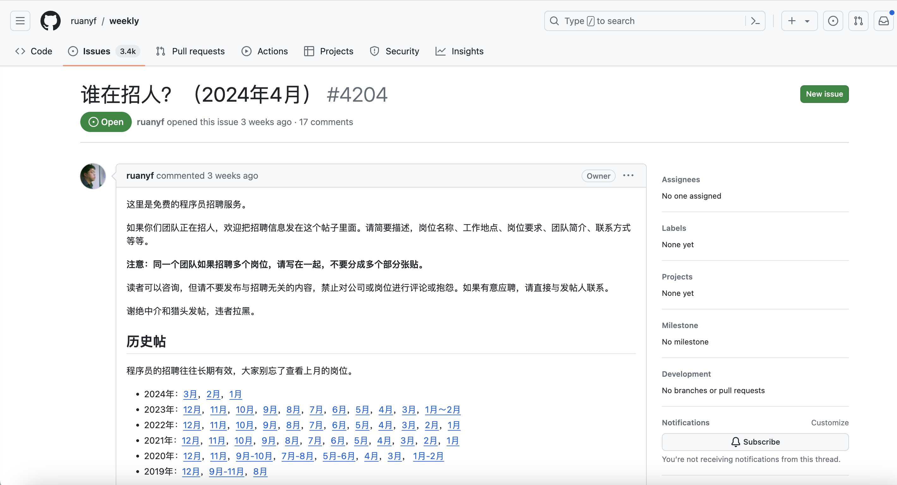
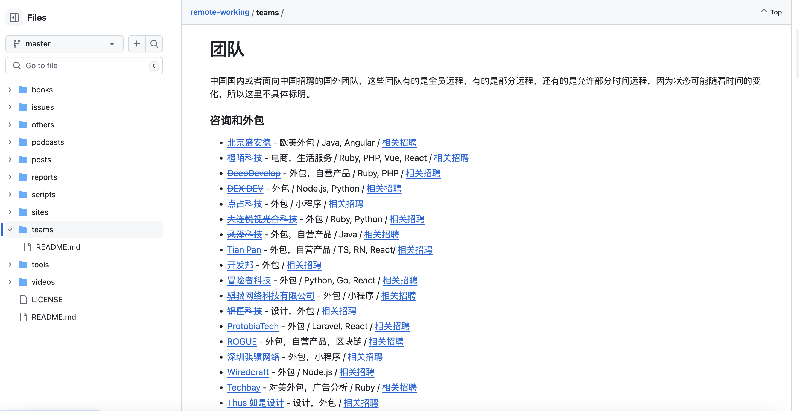
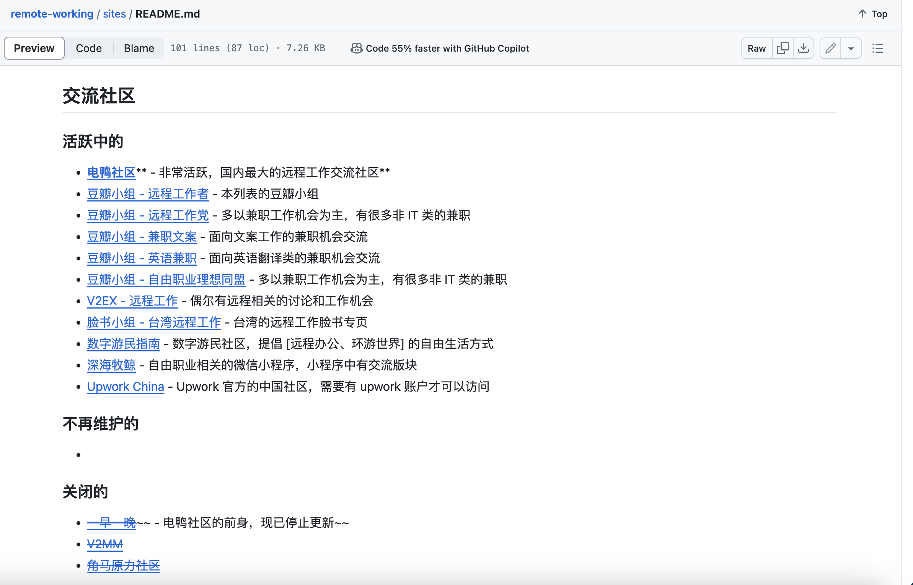

# 缘起
>在追求职业发展的道路上，工作并不仅仅是一个人的学历和能力。事实上，这是一个常见的误解——许多人认为，只要获得更高的学历，展现出足够的专业能力，就能保证获得理想的职位。然而，现实情况并非这样。
为什么呢？原因很简单：找工作并非只是找一个可以发挥你能力的平台，更关键的是找到一个你能在其中取得成功的环境。这就涉及到了我们的主题——信息差。

## 🔥 招聘热榜
### [🚀 V2Ex酷工作](https://www.v2ex.com/?tab=jobs)

> 
>
> **一句话总结**：V2EX 是一个面向程序员、极客人群的分享交流社区，汇聚了超过 600,000 名主要来自互联网、游戏和媒体行业的创意工作者。在这里，你可以找到有趣有意义的酷工作，也可以分享和探讨各行各业的经验和见解。

---

### [🛰️ 阮一峰老师 - 谁还在招人板块](https://github.com/ruanyf/weekly/issues/4204)

> 
>
> **一句话总结**：这个是阮一峰老师的科技爱好者周刊，每周五会发布的内容。它记录了每周值得分享的科技内容，欢迎投稿、推荐或自荐文章、软件和资源。此外，讨论区还提供了免费的程序员招聘信息。如果你对其中某个职位感兴趣，可以查看详细信息并投递简历。

---

### [🦆 电鸭社区](https://eleduck.com/categories/5)
>
>**一句话总结**：
>电鸭社区 是一个专注于远程工作招聘和交流的社区。在这里，你可以找到各种远程、外包、零活、兼职、驻场等非主流工作机会。社区鼓励“只工作，不上班”的工作态度，让你从电鸭开始，享受远程工作的便利和自由1。如果你对远程工作感兴趣，不妨去看看这个社区，或许会有适合你的机会哦！

---

### [✈️ remote-working](https://github.com/greatghoul/remote-working/tree/master/teams)

> 
>
> **一句话总结**：这个 GitHub 仓库是由 greatghoul 维护的，它收集整理了远程工作相关的资料。在这里，你可以找到关于远程工作的各种资源，包括文章、团队、视频、播客、站点、报告、书籍、工具等。如果你对远程工作感兴趣，这个仓库可能会对你有所帮助！

---

### [🌍 remote-working-site](https://github.com/greatghoul/remote-working/blob/f4d46997174e09852830b44fc33aee1e51ca5f01/sites/README.md)

> 
>
> **一句话总结**：这个列表主要用于整理中国国内的资源或者对国内受众友好的国外资源。如果你有远程工作相关的资源推荐，也可以通过表单或者 GitHub Issue 提交。

---

### [🏘️ 远程工作小组 - 豆瓣](https://www.douban.com/group/remoteworking)

> 
>
> **一句话总结**：这是一个名为“远程工作者小组”的豆瓣小组，成立于2019年3月14日。在这里，豆有们可以分享和讨论远程工作的经验、计划以及遇到的问题。如果你对远程工作感兴趣，不妨加入这个小组，与其他远程工作者交流心得。请注意，不要发布无意义的顶贴，以维护良好的社区氛围。

---

## // TODO 🤝 内推热榜

## // TODO 💰 副业热榜
